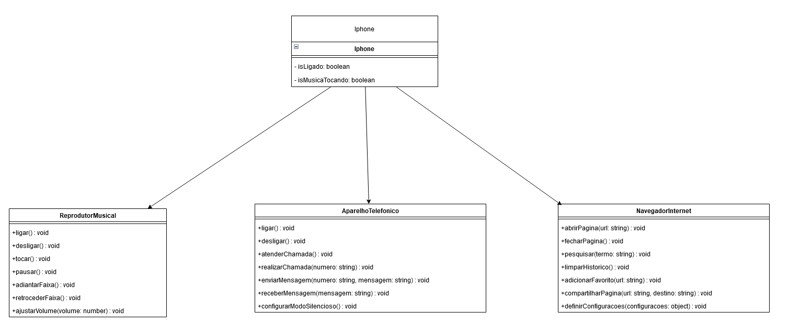

# Projeto de Modelagem do iPhone

O objetivo foi representar as funcionalidades do iPhone, incluindo Reprodutor Musical, Aparelho Telefônico e Navegador na Internet, de acordo com os comportamentos esperados. O resultado é um conjunto de classes e interfaces Java que simulam as operações do iPhone.

O diagrama acima representa a estrutura das classes e interfaces relacionadas ao iPhone e suas interações. As classes `ReprodutorMusical`, `AparelhoTelefonico` e `NavegadorInternet` são implementadas pela classe `Iphone`, que simula as operações esperadas.

Para obter mais detalhes, consulte o código fonte em [iphone/Iphone.java](caminho/para/o/arquivo/Iphone.java).

## Instruções de Uso

1. Clone este repositório.
2. Execute o arquivo Java `Main` para interagir com o iPhone simulado.

## Contribuições

Contribuições e melhorias são bem-vindas. Sinta-se à vontade para fazer um fork deste projeto e enviar suas sugestões.

